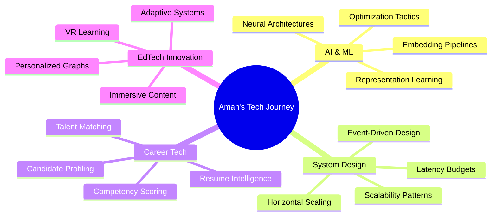

<!-- 
README Strategy:
- Dynamic, eye-catching animated elements
- Professional yet bold visual hierarchy
- Enhanced accessibility and mobile responsiveness
- Modular design with smooth animations
- Clear CTAs and engagement points
-->

<div align="center">

<!-- Animated Banner -->


</div>

<!-- Typing Animation -->
<p align="center">
  
</p>

<!-- Identity Section -->
<h3 align="center">
  <samp>
    Pre-Final Year CSE Undergrad | AI & ML Explorer | Systems Thinker<br/>
    EdTech & JobTech Innovator
  </samp>
</h3>

<p align="center">
  <em>"Engineering technology that empowers individuals and strengthens the nation."</em>
</p>

<!-- Badge Collection -->
<p align="center">
  <a href="mailto:aman75bundela@gmail.com">
    
  </a>
  <a href="https://www.linkedin.com/in/amanbundela75/" target="_blank">
    
  </a>
  <a href="https://github.com/Amanbundela75" target="_blank">
    
  </a>
</p>

<p align="center">
  
  
  
</p>

<br/>

<!-- Main Content Container -->
<div align="center">
  
## 🧭 「 Professional Snapshot 」

</div>

<table align="center">
<tr>
<td width="50%" valign="top">

### 🎯 Core Focus Areas

```yaml
AI_ML:
  - ML Architectures & Pipelines
  - Embedding Systems
  - Intelligent Scoring Engines
  
Systems:
  - Scalable Backend Patterns
  - IPC & Event-Driven Design
  - Performance Optimization

Innovation:
  - EdTech VR Experiences
  - Career Intelligence Systems
  - National Development Tech
```

</td>
<td width="50%" valign="top">

### 🚀 Current Builds

```python
active_projects = {
    "Competency Engine": {
        "status": "🔥 Building",
        "tech": ["ML", "Scoring", "Analytics"]
    },
    "VR Education": {
        "status": "🛰️ Active",
        "tech": ["VR", "Early Space", "Immersive"]
    },
    "Gesture Control": {
        "status": "✋ Sandbox",
        "tech": ["HCI", "Computer Vision"]
    }
}
```

</td>
</tr>
</table>

<br/>

<!-- Animated Divider -->


<br/>

## 🛠️ 「 Tech Arsenal 」

<div align="center">

### Frontend Mastery
<p>
  
</p>

### Backend & Systems
<p>
  
</p>

### AI & Data Science
<p>
  
  
  
</p>

### Databases & Cloud
<p>
  
</p>

### DevOps & Tools
<p>
  
</p>

### Programming Languages
<p>
  
</p>

</div>

<br/>

<!-- Animated Divider -->


<br/>

## 📊 「 GitHub Analytics 」

<div align="center">


</div>

<br/>

<details open>
<summary><h3>📈 Detailed Coding Metrics</h3></summary>

<div align="center">
  


</div>

</details>

<br/>

<!-- Animated Divider -->


<br/>

## 🏆 「 Achievements & Consistency 」

<div align="center">

### 💻 GeeksForGeeks - 250 Days Streak


<br/><br/>

### ⚡ LeetCode Badges Collection

**Consistency Achievements**
<p>
  
  
</p>

**Monthly Challenge Badges**
<p>
  
  
  
</p>

</div>

<br/>

<!-- Animated Divider -->


<br/>

## 🎯 「 Featured Projects 」

<div align="center">

<table>
<tr>
<td width="50%">

<h3 align="center">Gesture Control System</h3>
<div align="center">  
<a href="https://github.com/Amanbundela75" target="_blank">

</a>
</div>
<br/>
<p align="center">
  <em>Natural interaction interface with touchless HCI sandbox using computer vision</em>
</p>
<p align="center">
  
  
  
</p>

</td>
<td width="50%">

<h3 align="center">Student Personal Space</h3>
<div align="center">
<a href="https://github.com/Amanbundela75" target="_blank">

</a>
</div>
<br/>
<p align="center">
  <em>Comprehensive platform to track academic and extracurricular progression</em>
</p>
<p align="center">
  
  
  
</p>

</td>
</tr>
<tr>
<td width="50%">

<h3 align="center">AI in Warfare</h3>
<div align="center">
<a href="https://github.com/Amanbundela75" target="_blank">

</a>
</div>
<br/>
<p align="center">
  <em>Exploring ethical implications: Should machines decide who lives or dies?</em>
</p>
<p align="center">
  
  
</p>

</td>
<td width="50%">

<h3 align="center">VR Education Platform</h3>
<div align="center">
<a href="https://github.com/Amanbundela75" target="_blank">

</a>
</div>
<br/>
<p align="center">
  <em>Immersive early space education content modules for schools</em>
</p>
<p align="center">
  
  
  
</p>

</td>
</tr>
</table>

</div>

<br/>

<!-- Animated Divider -->


<br/>

## 🌱 「 Learning Journey 」

<div align="center">



</div>

<br/>

### 🎯 Current Focus Areas

<table>
<tr>
<td width="33%" align="center">

**🧠 Advanced ML**
<br/>
Representation learning<br/>
Optimization techniques<br/>
Production ML pipelines

</td>
<td width="33%" align="center">

**⚙️ System Design**
<br/>
Scalable architectures<br/>
IPC mechanisms<br/>
Performance tuning

</td>
<td width="33%" align="center">

**🚀 Innovation**
<br/>
EdTech solutions<br/>
Career intelligence<br/>
National-scale impact

</td>
</tr>
</table>

<br/>

<!-- Animated Divider -->


<br/>

## 💡 「 Philosophy & Vision 」

<div align="center">

### 🎭 Core Beliefs

<table>
<tr>
<td align="center" width="33%">

**Code as Infrastructure**
<br/><br/>

<br/><br/>
<em>Building scalable foundations</em>

</td>
<td align="center" width="33%">

**Intent at Scale**
<br/><br/>

<br/><br/>
<em>Amplifying purposeful impact</em>

</td>
<td align="center" width="33%">

**Evolution Over Features**
<br/><br/>

<br/><br/>
<em>Designing adaptive systems</em>

</td>
</tr>
</table>

<br/>

> **"Code is infrastructure. Infrastructure scales intent. Intent defines impact."**

<br/>

I don't just hack features—I design evolutionary capability.  
From ML scoring logic to VR education pipelines, I optimize for:

**Clarity** • **Usefulness** • **Long-term Adaptability**

</div>

<br/>

<!-- Animated Divider -->


<br/>

## 🤝 「 Let's Collaborate 」

<div align="center">

### 💬 Open to Discussions On

<table>
<tr>
<td align="center" width="25%">

**🎓 EdTech**
<br/>
VR Learning<br/>
Adaptive Systems<br/>
Knowledge Graphs

</td>
<td align="center" width="25%">

**💼 CareerTech**
<br/>
Talent Intelligence<br/>
Resume Parsing<br/>
Skill Matching

</td>
<td align="center" width="25%">

**🏥 HealthTech**
<br/>
Diagnosis Aids<br/>
Predictive Models<br/>
Patient Systems

</td>
<td align="center" width="25%">

**🇮🇳 Nation-Scale**
<br/>
Public Good Tech<br/>
Social Impact<br/>
Infrastructure

</td>
</tr>
</table>

<br/>

### 📫 Get In Touch

<p>
  <a href="mailto:aman75bundela@gmail.com">
    
  </a>
  <a href="https://www.linkedin.com/in/amanbundela75/">
    
  </a>
  <a href="https://github.com/Amanbundela75">
    
  </a>
</p>

<br/>

**Pitch purposeful ideas — I love structured brainstorming. 🚀**

</div>

<br/>

<!-- Animated Divider -->


<br/>

## 🎨 「 Coding Vibes 」

<div align="center">


</div>

<br/>

<!-- Animated Divider -->


<br/>

<div align="center">

### 💫 Final Words

**"I don't just write code — I architect tomorrow's systems."** 🚀

<br/>

<sub>Found something interesting? ⭐ Star a repo — it helps visibility & momentum!</sub>

<br/><br/>

<!-- Footer Wave -->


</div>

---

<div align="center">
  <sub>Made with 💙 and ☕ by Aman Bundela</sub>
  <br/>
  <sub>Last Updated: September 2025</sub>
</div>
